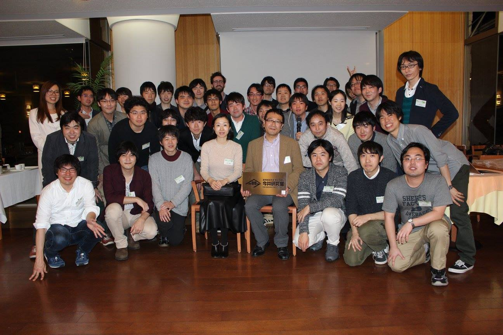
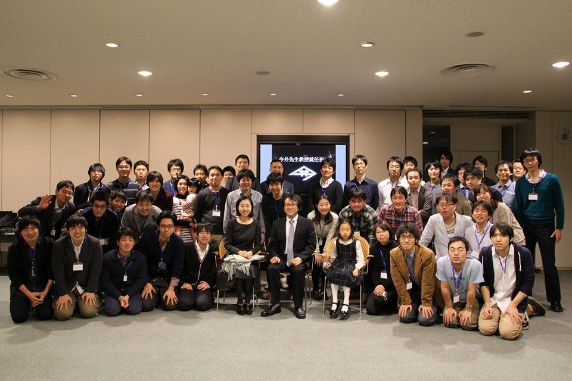

# Lintaraction 2024

本年も、今井研究室の現役生と卒業生の親睦を図ることを目的として、 
<b>Lintaraction 2024</b> を開催いたします。 
 
案内も本ウェブサイトとメールのみとさせていただきます。 
前回までのオンライン開催と異なり、今回は日吉での開催となります。 
 
下記のフォームから参加登録をお願いいたします。 
不参加の場合でも、連絡先をご登録いただければ次回以降のイベントをご案内します。 
 
 
なお、3/2(土) 当日Lintaraction前の11:00-12:30には、 
矢上キャンパス新棟で<a href="https://sites.google.com/view/imais/%E3%83%9B%E3%83%BC%E3%83%A0">「ImAI Symposium：知能メディアとインタラクション研究会 2024」</a>も開催されます。 
今井先生や今井研学生の方も参加されますので、興味ある方はどうぞ。 
また、自身の研究発表を研究会に申し込んでいただいても大丈夫です。 

# 開催概要

| 日時 | 2023年3月2日（土）13:00 - 15:00 |
| 会場(予定) | HUB慶應日吉店 |
| ドレスコード | なし |
| 参加費 |確定次第、ウェブとメールにてご連絡いたします。 |

# 参加登録・連絡先登録



※不参加の場合でも、ご登録いただければ次回以降のイベントをご案内します。 
また、今井研究室の卒業生の名簿の更新も兼ねております。ご協力いただければ大変助かります。

# 過去の開催

**第1回 Lintaraction**

2016年3月19日 慶應義塾大学日吉ファカルティラウンジ

**今井先生教授就任祝い**

2014年11月15日 慶應義塾大学矢上キャンパス創想館7F

